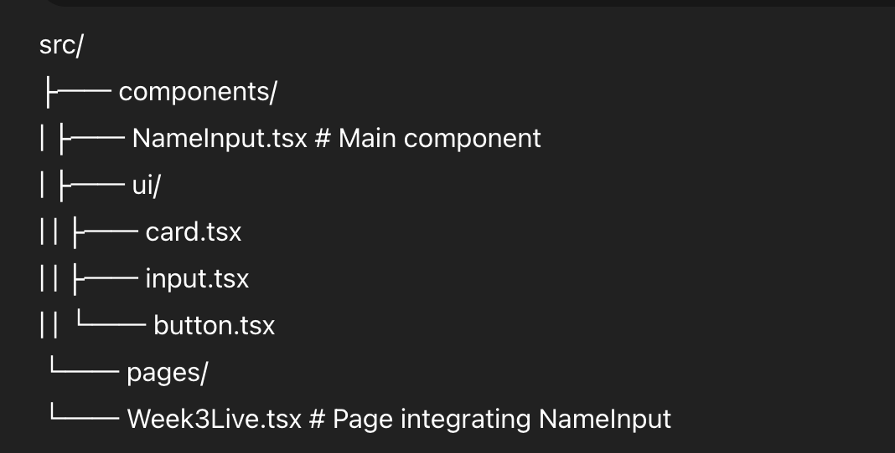

# NameInput Component – Week 3 Assignment

## 📚 Overview
This project implements a **controlled React form** that personalizes a user’s experience by asking for their name (and optionally their email and favorite color). The component demonstrates state management, input validation, and conditional rendering using React hooks.

---

## 🚀 Features & Functionality

### ✅ Core Requirements
- **Name Input Form**
  - Controlled input using `useState`
  - Real-time validation (name must be at least 2 characters)
  - Error message displayed when validation fails
  - Greeting message displayed when a valid name is submitted
  - "Clear" button resets the entire form

- **Email Input (Optional)**
  - If filled, must contain `@` and `.`
  - Error message shown for invalid emails

---

### 🌈 Bonus Features
- **Character Count:** Displays the number of characters as the user types
- **Favorite Color Dropdown:** Lets users pick a color, which is shown in the greeting
- **Local Storage Integration:** Remembers the last entered name even after refreshing the page
- **Responsive Card Layout:** Uses TailwindCSS and ShadCN UI components for a clean, modern UI

---

## 🧩 Technologies Used
- **React (with TypeScript)**
- **Tailwind CSS**
- **ShadCN UI Components (`Card`, `Input`, `Button`)**
- **LocalStorage API**

---

## 🧠 Learning Objectives Demonstrated
By completing this assignment, I practiced and demonstrated proficiency in:
- Controlled form components (`useState`)
- Handling and validating user input
- Conditional rendering for dynamic messages
- Managing state and side effects (`useEffect`)
- Building accessible and reusable UI components

---

## 🧪 How It Works
1. The user enters their **name** and optionally their **email** and **favorite color**.
2. Clicking **"Say Hello"** validates inputs and displays a personalized greeting.
3. The **"Clear"** button resets all fields and clears the saved name from `localStorage`.
4. If a name was previously entered, it automatically loads when the component mounts.

---

## 🧩 File Structure
